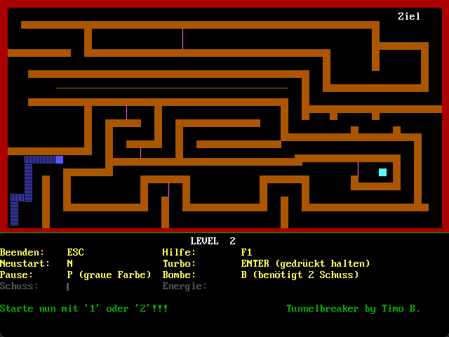

# TunnelBreaker

TunnelBreaker is the first program I've ever written that's longer than 10 lines of code. I wrote it years ago when I was ~14. You can open and run the application with [qb64](https://qb64.com). Unfortunately, only German language is supported. I hope I didn't break file encoding (otherwise some non ASCII characters might look weird). The original code page is 437 (DOS).

## Game Play

You are a blue square trying to escape a labyrinth. Your goal is to reach the area labeled "Ziel" ("goal" in english) without touching any walls. Be careful though, once you started moving you cannot stand still. Luckily, the environment is fully destructible - if you have the necessary energy or ammunition.

The current version contains three built-in levels and a level editor where you can create your own levels. Unfortunately, the level editor is incomplete and only supports wall placement.

**Note:** The path for game files is hardcoded and points to `C:\TB\`. I didn't know how to do file checks back then so the game will ask you if files exist and if you lie to it, the game will crash.

## Implementation

The quality of the implementation is - to no surprise - extremely poor. My biggest sin is - probably - the implementation of timing related things (movement, animations, sound), which is done with a for loop that just counts up - no sleep. This game will definitely drive up one of your cores to 100%.
